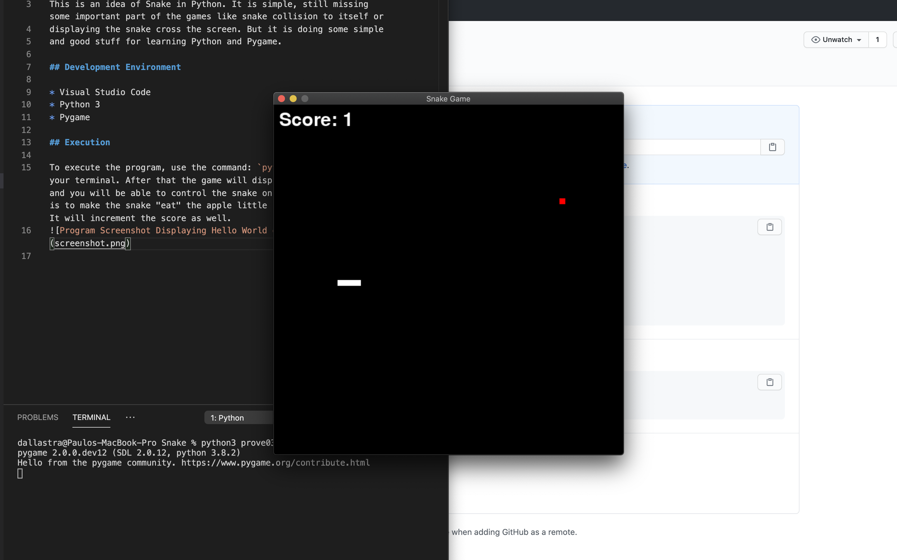

# OVERVIEW

This is an idea of Snake in Python. It is simple, still missing some important part of the games like snake collision to itself or
displaying the snake cross the screen. But it is doing some simple
and good stuff for learning Python and Pygame.

## Development Environment

* Visual Studio Code
* Python 3
* Pygame

## Execution

To execute the program, use the command: `python3 prove03.py` on your terminal. After that the game will display in another window and you will be able to control the snake on the screen. The goal is to make the snake "eat" the apple little red dot on the screen. It will increment the score as well.

